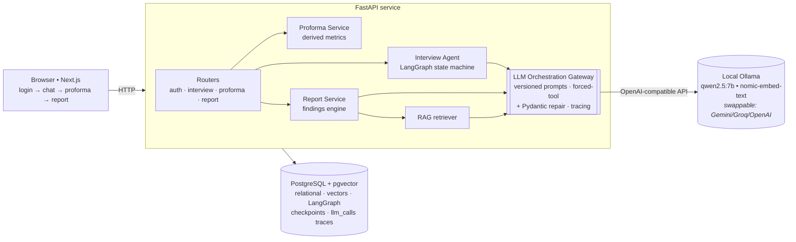

# FixFinance

**An AI personal-finance consultant (MVP) for the Indian market.**

FixFinance interviews a user in plain language, distills the conversation into a structured, editable **financial profile (proforma)**, and produces a **preliminary advisory report** in which every recommendation is grounded in a cited, authoritative source (SEBI / RBI / IRDAI / AMFI / Income-Tax Dept) and the user's own numbers.

It runs **fully local at zero cost** — generation and embeddings go through a provider-agnostic gateway pointed at [Ollama](https://ollama.com) by default, so no financial data leaves the machine and there are no API bills or rate limits.

> ⚠️ Educational information, not regulated financial advice. No SEBI/IRDAI registration is implied.

---

## What it does

1. **Conversational onboarding** — a checkpointed interview agent extracts facts turn-by-turn (₹, EPF, SIP, FD, 80C, old/new tax regime) and tracks coverage until the profile is sufficient.
2. **Editable proforma** — a versioned (append-only) financial profile; every value carries provenance (`ai_extracted` / `user_edited` / `derived`) + a confidence score; rule-based derived metrics (savings rate, emergency-fund months, 80C utilization, asset allocation…).
3. **Grounded report** — a deterministic findings engine (metric → severity → principle) feeds RAG-retrieved principles into synthesis; ratings and citations are set authoritatively from the engine itself, never the LLM, so sources can't be hallucinated.

**Highlights**
- Stateful interview as a **LangGraph** state machine, checkpointed in Postgres (resumable across turns).
- **Schema-enforced extraction:** the model is pinned to a forced tool call validated against a Pydantic schema, with a bounded repair loop.
- **Knowledge-grounded RAG:** financial principles live as editable, source-cited YAML, embedded into **pgvector**.
- **Observability + tests:** every model call is traced (`llm_calls`); a fixture-based eval harness (incl. LLM-as-judge) is the regression guard.
- **Provider-agnostic:** swap Ollama → Gemini → Groq → OpenAI with a `.env` change, no code change.

---

## Architecture



**Request trace:** Browser → FastAPI router → service (interview / proforma / report) → **Gateway** → the LLM, with a RAG retriever and trace store hanging off the gateway, all persisted in one Postgres database. The gateway is the only path from application code to a model — it owns versioned prompts, forced-tool structured output, the Pydantic repair loop, and tracing.

---

## Tech stack

- **Backend:** Python 3.12 · FastAPI · Pydantic · SQLAlchemy (async) · LangGraph
- **LLM + embeddings:** provider-agnostic via the OpenAI SDK — default **local Ollama** (`qwen2.5:7b`, `nomic-embed-text` 768-dim); Gemini / Groq / OpenAI by env
- **Data:** PostgreSQL 16 + **pgvector** (relational + vectors + agent checkpoints + traces — one server)
- **Frontend:** Next.js (App Router) · React
- **Packaging:** Docker Compose (`web` / `api` / `db`)

---

## Quickstart

**Prerequisites**
- Docker (Docker Desktop or Colima) with the daemon running. *Use the hyphenated `docker-compose` (V1) if Compose V2 isn't installed.*
- [Ollama](https://ollama.com) running on the host, with the models pulled:
  ```bash
  brew services start ollama
  ollama pull qwen2.5:7b
  ollama pull nomic-embed-text
  ```

**Run**
```bash
cp .env.example .env          # defaults target local Ollama; set ADMIN_KEY etc.
docker-compose up -d --build  # db (:5432) + api (:8000) + web (:3000)
curl -s localhost:8000/health | python3 -m json.tool
# healthy: {"db":"up","pgvector":true,"public_tables":13,"status":"ok"}
```

**Demo flow**
1. Provision a user (admin-only — temporary auth for the MVP):
   ```bash
   curl -s -XPOST localhost:8000/admin/users \
     -H "X-Admin-Key: $(grep ^ADMIN_KEY= .env | cut -d= -f2)" \
     -H 'Content-Type: application/json' -d '{"label":"demo"}'
   # → {"username": "...", "password": "..."}  (shown once)
   ```
2. Open **http://localhost:3000**, log in, and chat through the interview.
3. When the profile is complete, click **Build my profile** → review/edit the proforma (confidence flags on AI-extracted fields) → **Generate report**.
4. The report polls until ready, then renders rating chips, recommendations, and **clickable cited sources**.

**Tests / evals**
```bash
docker-compose exec api python evals/run_evals.py   # prints a pass/fail table, exits non-zero on failure
```

**Stopping / managing the stack** (run from the project root)
```bash
docker-compose stop      # pause all 3 containers; resume with `docker-compose start` (fastest)
docker-compose down      # stop + remove containers/network; KEEPS the pgdata volume (data survives)
docker-compose down -v   # also WIPES pgdata → DDL re-runs on next `up` (loses users/proformas/reports/traces)
```
- Just pausing → `stop`; clean shutdown keeping data → `down`; fresh slate / schema change → `down -v`.
- **Ollama is separate** (a host service, not part of compose) and keeps running — stop it if you like with `brew services stop ollama`.

---

## Project layout

```
api/                      FastAPI backend (Python 3.12)
  app/
    orchestration/        LLM gateway — versioned prompts, forced-tool, repair, tracing
    agent/                LangGraph interview (state · graph · nodes · coverage)
    schemas/              Pydantic: proforma (the core contract), report
    services/             proforma (versioning + derived metrics), report (findings + synthesis), auth
    rag/                  embeddings · indexer · retriever (pgvector)
    routers/              auth · interview · proforma · report
  knowledge/principles/   editable, source-cited financial-principles knowledge base (YAML)
  db/schema.sql           DDL (auto-run on first boot)
  evals/                  fixture harness + LLM-judge (run_evals.py)
web/                      Next.js UI (login → chat → proforma editor → report viewer)
docker-compose.yml
```

---

## Implementation notes

- **Provider-agnostic by design.** The only LLM SDK in the codebase lives behind the gateway's `call_text` / `call_structured`; the provider is a `.env` setting (`base_url` + `key` + `model`).
- **The extraction DTO ≠ the domain model.** The model emits a *flat* `ExtractedFacts` + a confidence map; code re-applies the provenance-tracked `Field[T]` wrapper. (Smaller/local models reliably fill flat fields but not deeply nested objects.)
- **Deterministic facts.** Derived metrics, finding severities, and report citations are computed/canonicalized in Python; the LLM only writes prose, so citations are always authentic.
- **Small-model hardening.** The gateway strips JSON-schema `title` keys (which smaller models echo back), and report enums tolerate model phrasing — so structured output is robust without a frontier model.

## Known limitations (MVP)

- Auth is temporary (admin-provisioned) and isolated for easy replacement.
- `qwen2.5:7b` extraction can miss facts buried in a single dense sentence; the multi-turn interview (with coverage re-probing) is more reliable. Bumping to `qwen2.5:14b` improves this at no cost.
- Confidence-driven re-probing depends on the model populating a confidence map; some local models under-fill it (values default to a safe 0.7).
- Follow-ups / monitoring / multi-agent consensus are out of scope for the MVP.
